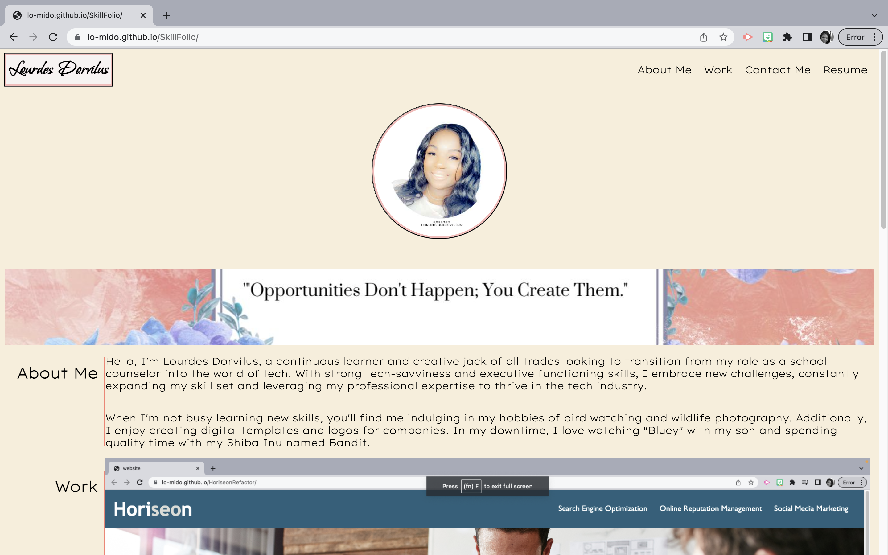

# 02 Portfolio

## During our boot camp course, we were assigned a project aimed at helping us create a portfolio of our work that effectively showcases our skills and talents as web developers. The project focused on utilizing Flexbox, media queries, and CSS variables, allowing us to practice and strengthen our newly acquired skills while creating web applications that can be deployed and used during our job search.

My motivation to complete this project stemmed from the desire to refine my CSS and HTML coding abilities from scratch and to construct a portfolio that effectively demonstrates my talents and skills as a budding web developer. Ultimately, my goal is to enhance my prospects for success by having multiple deployed web applications to present to potential employers.

The project addresses the problem of students needing to showcase their abilities and attract the attention of prospective employers. By creating and deploying web applications, we can provide tangible evidence of our skills and exhibit our thought processes and problem-solving capabilities. This significantly enhances our employability and increases the likelihood of receiving initial interviews at companies that place importance on reviewing a portfolio of work.

Throughout the project, I have learned invaluable skills in web development, including the effective use of Flexbox, media queries, and CSS variables. Additionally, I have gained practical experience in constructing responsive and visually appealing web applications. I understand the significance of having multiple deployed projects in my portfolio, as it sets me apart in the highly competitive job market. This project has given me a comprehensive understanding of how to present my work effectively, highlighting my strengths to potential employers and maximizing my chances of securing desirable opportunities.

## Table of Contents:

Paragraph 1: What was the assignment or task?
Paragraph 2: What was your motivation?
Paragraph 3: What problem does it solve?
Paragraph 4 What did you learn? Why did you build this project?

## Installation

N/A

## Usage

Use this Link:

<a href="https://lo-mido.github.io/SkillFolio/" > Link to Live Website.</a>

## Credits: Team Work Make the Dream Work! We worked together systematically on zoom totaling a total of 15+ Hours

Annie Sosa, https://github.com/asosadia88
Rujane Mena, GitHub.com/rujainemena
Liz Garcia, https://github.com/bizwliz
Phil Loy
Lourdes Dorvilus https://github.com/lo-mido

## Tutorial Links:

https://courses.bootcampspot.com/courses/3883/assignments/57119?module_item_id=1004720
https://www.w3schools.com/css/css_selectors.asp
https://www.w3schools.com/html/html_attributes.asp
https://htmlcheatsheet.com/css/
https://apps.apple.com/us/app/mimo-learn-coding-programming/id1133960732?ppid=36dc2281-6a01-4f94-ad52-05a0a7062255
https://youtu.be/tRZGeaHPoaw

## License

MIT License

Copyright (c) 2023 Lourdes Dorvilus

Permission is hereby granted, free of charge, to any person obtaining a copy
of this software and associated documentation files (the "Software"), to deal
in the Software without restriction, including without limitation the rights
to use, copy, modify, merge, publish, distribute, sublicense, and/or sell
copies of the Software, and to permit persons to whom the Software is
furnished to do so, subject to the following conditions:

The above copyright notice and this permission notice shall be included in all
copies or substantial portions of the Software.

THE SOFTWARE IS PROVIDED "AS IS", WITHOUT WARRANTY OF ANY KIND, EXPRESS OR
IMPLIED, INCLUDING BUT NOT LIMITED TO THE WARRANTIES OF MERCHANTABILITY,
FITNESS FOR A PARTICULAR PURPOSE AND NONINFRINGEMENT. IN NO EVENT SHALL THE
AUTHORS OR COPYRIGHT HOLDERS BE LIABLE FOR ANY CLAIM, DAMAGES OR OTHER
LIABILITY, WHETHER IN AN ACTION OF CONTRACT, TORT OR OTHERWISE, ARISING FROM,
OUT OF OR IN CONNECTION WITH THE SOFTWARE OR THE USE OR OTHER DEALINGS IN THE
SOFTWARE.

## How to Contribute

Lourdes M. Dorvilus

## Tests

Using VS Code & GIT HUB to host the webpage.
